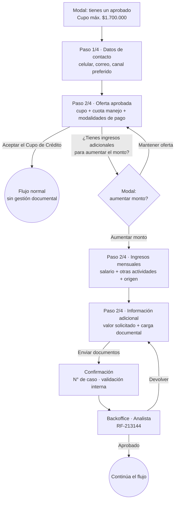

# Mapa de flujos · Gestión Documental (Zona Gris)

Mapa pantalla-por-pantalla de cada variante que puede terminar en carga documental, construido a partir de los mockups de Figma. Complementa el requerimiento funcional en [project_gestion_documental_zona_gris.md](project_gestion_documental_zona_gris.md); el copy parametrizable está en [reference_drupal_contenido_gestion_documental.md](reference_drupal_contenido_gestion_documental.md).

## Estado del mapa

| # | Flujo | Caso del requerimiento | Estado |
|---|---|---|---|
| A | **Aprobado en firme · usuario con soportes para mejorar la oferta** | Caso 2.2 | ✅ Mapeado |
| B | **Preaprobado con oferta · usuario con soportes para mejorarla** | Caso 2.1 | ✅ Mapeado |
| C | **Preaprobado sin oferta · envío directo a carga documental** | Caso 1.1 | ✅ Mapeado |
| D | **Aumento · envío directo y acceso voluntario a GD** | Variante 4 flujograma | 🟡 Parcial (rama voluntaria mapeada) |
| E | **Reactivación simple · SIN carga documental** | Variantes 3 y 5 flujograma | 🟡 Parcial (solo pantalla de cierre) |
| F | Otros flujos que **no** requieren carga documental | Variante 5 flujograma | ⏳ Pendiente |

---

# Flujo A · Aprobado en firme con soportes para mejorar la oferta

**Cuándo aplica:** el motor entregó un **aprobado en firme** (oferta lista para aceptar). El usuario **no fue rechazado**; es él quien decide pedir un monto mayor aportando soportes de ingresos adicionales. Es el **formulario corto**.

## Secuencia de pantallas

| Paso | Pantalla | Contenido clave | Salidas |
|---|---|---|---|
| 0 | **Modal de bienvenida** sobre datos de contacto | "¡Hola [User Name], tienes un aprobado!" · "Inicia la solicitud de tu **[Producto principal]** para pagar tus compras a cuotas…" · **Cupo máximo aprobado $1'700.000** · callout de vigencia de la oferta ("válida hasta el 21 de diciembre de 2026", sujeta a políticas de crédito — texto aprox.) | `Continuar solicitud` |
| 1 | **Paso 1 de 4 · Información personal** → "¿Cómo podemos contactarte?" | Número de celular + **Confirma tu número** · Correo electrónico + **Confirma tu correo** · **Canal preferido para notificaciones** (helper: "En este canal recibirás mensajes sobre el estado de tu solicitud") | `Continuar` |
| 2 | **Paso 2 de 4 · Personalización de la solicitud** → oferta | "¡Felicidades [User name], este es el cupo aprobado para tu solicitud!" · **Cupo aprobado $1'700.000** con **Ajustar cupo** ✏️ · Cuota de manejo mensual $6.579 · Seguros mensuales $2.606 · callout "Recuerda que pagarás la cuota siempre y cuando utilices tu Cupo de Crédito" · **3 modalidades de pago** (Paga con tu subsidio $74.500 / Paga una cuota fija $65.000 / Elige cuántas cuotas al hacer tus compras), cada una con sus tasas M.V., N.M.V. y efectiva anual · link "¿Cómo funciona la cuota de manejo?" | **`Aceptar el Cupo de Crédito`** (salida sin GD) · **link "¿Tienes ingresos adicionales para aumentar el monto aprobado?"** → paso 3 |
| 3 | **Modal de bifurcación** | "¿Tienes ingresos adicionales para aumentar el monto aprobado?" · "Tu oferta está lista para aceptar, sin embargo, podrás solicitar el análisis de un aumento de monto actualizando el detalle de tus ingresos." · callout "Ten a la mano los documentos de soporte — durante la solicitud para aumentar el monto, deberás adjuntar documentos que demuestren tus ingresos adicionales" | **`Mantener oferta`** → vuelve al paso 2 · **`Aumentar monto`** → entra a Zona Gris |
| 4 | **Paso 2 de 4** → "¿Cuáles son tus ingresos mensuales?" | Salario básico mensual (12.000.000) · Ingresos adicionales en tu trabajo (Opcional) · **¿Tienes ingresos adicionales por otras actividades? Sí/No** → al marcar Sí: callout de soportes + Ingresos mensuales adicionales (4.000.000) + **Tipo de actividad** (Pagos adicionales) + **Origen específico del ingreso** (Horas extras) | `Volver` · `Continuar` |
| 5 | **Paso 2 de 4** → "Información adicional" | "Para facilitar el análisis de tu solicitud, necesitamos ingresar datos adicionales y documentos de soporte sobre tus ingresos" · **Valor solicitado** (Mínimo $700.000 — Máximo aprobado) · alerta de requisitos PDF/3.5 MB · bloques de documentos con estado **Por adjuntar**: Extractos bancarios (0/3), Declaración de renta (0/1), Estados financieros (0/1), **Comprobantes de nómina** con radio Pago quincenal (6) / Pago mensual (3), Soporte de otros ingresos (opcional) | `Volver` · **`Enviar documentos`** (deshabilitado hasta completar) |
| 6 | **Confirmación** | "[UserName], nuestro equipo revisará tus documentos" · Número de caso · card con Producto / Valor solicitado / Fecha / Canal de notificación · "¿Qué sigue ahora?" (3 pasos) | Fin — caso en validación interna |

## Diagrama

## Reglas de formulario y accesibilidad (notas del diseño)

- **Todos los campos del formulario de contacto son obligatorios** para avanzar: hasta que no estén llenos, el botón `Continuar` debe estar **deshabilitado**.
- **Opciones del dropdown "Canal preferido para notificaciones" (parametrizables):**
  - **SMS / Mensaje de texto — MVP**
  - **Correo electrónico — MVP**
  - **WhatsApp — evolución (fuera del MVP)**
- **Accesibilidad:** el formulario debe ser **navegable por teclado**, indicando al usuario dónde está el foco de los elementos interactivos, de **izquierda a derecha**.

## Hallazgos que el requerimiento escrito no reflejaba

1. **La numeración de pasos cambia según el flujo.** Aquí los ingresos y la carga documental están en **Paso 2 de 4 · Personalización de la solicitud**; en el formulario largo esas mismas pantallas aparecen en **Paso 1 de 4 · Información personal**. No asumir un breadcrumb fijo al automatizar.
2. **La entrada a Zona Gris es un link + modal de confirmación**, no un checkbox: link "¿Tienes ingresos adicionales para aumentar el monto aprobado?" → modal con `Mantener oferta` / `Aumentar monto`. El modal es el punto de no retorno hacia GD.
3. **El canal de notificación se captura en el Paso 1 (datos de contacto), para todos**, no como "dato adicional" dentro de Zona Gris como decía el requerimiento.
4. **El requerimiento pedía que el formulario corto incluyera Valor solicitado, Salario mensual, Ingresos adicionales y Otras fuentes en un solo formulario**; el diseño lo **parte en dos pantallas**: ingresos (paso 4) y valor solicitado dentro de Información adicional (paso 5).
5. **La oferta tiene vigencia** ("válida hasta el …"), dato que no aparecía en el requerimiento y que habilita un caso de prueba de oferta expirada.
6. La pantalla de oferta permite **Ajustar cupo** por su cuenta — distinto de "aumentar monto vía Zona Gris". Son dos acciones diferentes sobre el mismo cupo y conviene no confundirlas al escribir los casos.

## Contradicción a resolver

**WhatsApp aparece como "evolución" (fuera del MVP)** en las notas del dropdown, pero el mockup de la pantalla de confirmación muestra **"Canal de notificación: WhatsApp"**. O el mockup de confirmación usa un ejemplo no-MVP, o el alcance del MVP cambió. Confirmar con diseño/PO antes de fijar los datos de prueba.

## Casos de prueba que salen de este flujo

- `Aceptar el Cupo de Crédito` directo → **no** debe activar gestión documental (es el flujo F).

- `Mantener oferta` en el modal → regresa a la oferta intacta, sin marcar el caso como Zona Gris.
- `Aumentar monto` → entra a ingresos; verificar que el aprobado en firme original **se conserve** por si el análisis no mejora la oferta.
- Botón `Continuar` deshabilitado con cualquier campo de contacto vacío, y validación de que celular/correo coincidan con su campo de confirmación.
- Dropdown de canal: solo **SMS y Correo** en MVP.
- Navegación completa por teclado con foco visible.
- `Valor solicitado` fuera de rango (< $700.000 o > máximo aprobado).

---

# Flujo C · Preaprobado SIN oferta — envío directo a carga documental

Mockups: **"5.0. Modal de Preaprobado"**, **"5.1. Datos de contacto"**, **"6.1 / 6.1.1 Datos Ingresos Dependientes"**, **"Información adicional"**. Es el **formulario largo** (Caso 1.1).

**Diferencia estructural:** aquí **no hay pantalla de oferta ni modal de bifurcación**. El usuario no elige ir a Zona Gris — el motor lo envía directo a carga documental. Todo transcurre dentro del **Paso 1 de 4 · Información personal**.

## Secuencia

| Paso | Pantalla | Contenido clave |
|---|---|---|
| 0 | **Modal de preaprobado** | "¡Hola [User Name], tienes un **preaprobado**!" · **Cupo máximo preaprobado $1'700.000** · callout "Oferta válida hasta el 20 de diciembre de 2026. **La confirmación del preaprobado** está sujeta a las políticas de solicitud de crédito" · `Continuar solicitud` |
| 1 | **Paso 1 de 4** → "¿Cómo podemos contactarte?" | Items Drupal **1-6** |
| 2 | **Paso 1 de 4** → "¿Cuáles son tus ingresos mensuales?" | Items Drupal **7-14** |
| 3 | **Paso 1 de 4** → "Información adicional" | Items Drupal **19-24**: Valor solicitado + bloques de documentos, todos en **Por adjuntar** · `Enviar documentos` deshabilitado |
| 4 | **Confirmación** | Variante con carga documental |

## Modal de bienvenida: preaprobado vs aprobado en firme

| | Flujo C · Preaprobado | Flujo A · Aprobado en firme |
|---|---|---|
| Título | "tienes un **preaprobado**" | "tienes un **aprobado**" |
| Monto | "Cupo máximo **preaprobado**" | "Cupo máximo **aprobado**" |
| Callout | "**La confirmación del preaprobado** está sujeta a las políticas de solicitud de crédito" | "**La continuación del aprobado** está sujeta a las políticas de solicitud de crédito" |
| Vigencia (ejemplo) | 20 de diciembre de 2026 | 21 de diciembre de 2026 |

## Reglas del formulario de ingresos (nota del diseño)

**Campos obligatorios para avanzar: solo 2** — (1) Salario básico mensual y (2) la pregunta "¿Tienes ingresos adicionales por otras actividades?".

> Nota literal del diseño: *"'¿Tienes ingresos adicionales por otras actividades?' puede ser **'no'** y el usuario aún así podría avanzar"*.

**Accesibilidad:** el formulario **y todos los de la bifurcación** deben ser navegables por teclado, indicando dónde está el foco de los elementos interactivos, de izquierda a derecha.

## Confirmación importante: la numeración amarilla de Figma = items de Drupal

Los mockups traen **globos amarillos numerados** que corresponden **exactamente** a los items de la matriz de contenido parametrizable ([reference_drupal_contenido_gestion_documental.md](reference_drupal_contenido_gestion_documental.md)):

- Datos de contacto → **1-6**
- Ingresos mensuales → **7-14**
- Información adicional / carga documental → **19-24**

Esto valida la reconstrucción de la matriz y da una forma directa de rastrear cualquier texto de pantalla hasta su campo en Drupal.

## Nota transversal del diseño

El mockup de datos de contacto está marcado como **"Cambio transversal a flujos — Importante: este formulario aplica para todos los flujos de solicitud (cuando corresponda)"**. Confirma que la pantalla de contacto (con el canal de notificación) es **común a todos los flujos**, no exclusiva de Zona Gris.

---

# Flujo B · Preaprobado con oferta — usuario con soportes para mejorarla

Mockups: **"2. Oferta Cupo — Landing"** y **"2. Oferta Cupo — Modal confirmación de solicitud aumento de cupo"**. Es el **formulario largo** (Caso 2.1).

## Secuencia

Idéntica al flujo A a partir de la oferta: **Oferta ($1'700.000, 3 modalidades) → link → modal → ingresos → Información adicional → confirmación**.

### Pantalla de oferta (landing)

"¡Felicidades [User name], este es el cupo aprobado para tu solicitud!" · Cupo aprobado **$1'700.000** + `Ajustar cupo` · Cuota de manejo mensual $6.579 · Seguros mensuales $2.606 · callout de "solo pagas si usas el cupo" · link **(1)** "¿Tienes ingresos adicionales para aumentar el monto aprobado?" · **"Elige cómo pagar tus cuotas mensuales"** con 3 tarjetas · `Aceptar el Cupo de Crédito`.

| Modalidad | Cuota | Tasa N.M.V. | Tasa avance N.M.V. | Tasa efectiva anual |
|---|---|---|---|---|
| Paga con tu subsidio | $74.500 | 1,56% | 2,36% | 19,12% |
| Paga una cuota fija | $65.000 | 1,56% | 2,38% | 19,12% |
| Elige cuántas cuotas al hacer tus compras | — | 1,44% | 2,36% | 18,68% |

Diferenciadores por tarjeta: la de **subsidio** descuenta del monto del subsidio familiar; la de **cuota fija** aplica en almacenes Colsubsidio; la de **elige cuántas cuotas** varía la cuota según valor y número de cuotas. Todas: máximo 36 cuotas y "la tasa puede variar mes a mes".

## Observación importante sobre A vs B

**Las pantallas de oferta de los flujos A (aprobado en firme) y B (preaprobado) son visualmente idénticas**: mismo monto de ejemplo, mismas 3 modalidades, mismo link y mismo modal. La diferencia entre los casos 2.1 y 2.2 del requerimiento **no está en la pantalla de oferta sino en el formulario previo** (largo vs. corto), es decir en cuánta información se capturó antes de llegar aquí. **Confirmar con diseño**, porque si es así, el punto de entrada a Zona Gris es un componente único reutilizado por ambos flujos y no hay que probarlo dos veces.

---

# Flujo D · Aumento de cupo — envío directo y acceso voluntario a GD

Mockup: **"7.0. Oferta de cupo de crédito — Aumento"**. Tiene **dos ramas**: el **envío directo** (el motor manda el caso a carga documental) y el **acceso voluntario** (el usuario, con aumento ya aprobado, pide más monto). Lo mapeado aquí es la **rama voluntaria**.

## Secuencia de pantallas

| Paso | Pantalla | Contenido clave | Salidas |
|---|---|---|---|
| 1 | **Paso 1 de 4 · Información personal** → "¿Cómo podemos contactarte?" | Idéntica al flujo A: celular + confirmación, correo + confirmación, canal preferido | `Continuar` |
| 2 | **Paso 2 de 4 · Personalización de la solicitud** → oferta de aumento | Toast **"Tienes un aumento aprobado"** · "¡Felicidades [User name]! **Este es tu nuevo cupo**" · **Cupo aprobado $10'200.000** con **Ajustar cupo** ✏️ · callout "Recuerda que solamente pagarías la cuota cuando realices compras con tu Cupo de Crédito" · **tabla "Ten en cuenta las siguientes condiciones"** · link "¿Cómo funciona la cuota de manejo?" | **`Aceptar el aumento del cupo`** (salida sin GD) · **link "¿Tienes ingresos adicionales para aumentar el monto aprobado?"** → paso 3 |
| 3 | **Modal de bifurcación** | Idéntico al del flujo A: "¿Tienes ingresos adicionales para aumentar el monto aprobado?" + callout de soportes | `Mantener oferta` → vuelve · **`Aumentar monto`** → Zona Gris |
| 4 | **Paso 2 de 4** → "¿Cuáles son tus ingresos mensuales?" | Salario básico · Ingresos adicionales en tu trabajo (**Opcional**) · ¿Otras actividades? Sí/No → Sí despliega Ingresos mensuales adicionales + Tipo de actividad + Origen específico | `Volver` · `Continuar` |
| 5 | **Paso 2 de 4** → "Información adicional" | Valor solicitado + carga documental (igual al flujo A) | `Enviar documentos` |
| 6 | **Confirmación** | Variante con carga documental (3 pasos, 4 items en el card) | Fin |

### Tabla de condiciones (paso 2)

| Concepto | Valor |
|---|---|
| Tipo de Cuota | **Fija** |
| Cuota Mensual | $74.500 |
| Fecha de pago | 1 al 16 de cada mes |
| Cuota de manejo mensual | $6.579 |
| Seguros mensuales | $2.606 |
| Tasa N.M.V. | 1,56% |
| Tasa avance N.M.V. | 2,36% |
| Tasa efectiva anual | 19,12% |

## Diferencia estructural con el flujo A (aprobado en firme)

| | Flujo A · Aprobado en firme | Flujo D · Aumento |
|---|---|---|
| Aviso de entrada | Modal "¡Hola…, tienes un aprobado!" | **Toast** "Tienes un aumento aprobado" |
| Título de la oferta | "este es el **cupo aprobado para tu solicitud**" | "**Este es tu nuevo cupo**" |
| Condiciones de pago | **3 modalidades elegibles** (subsidio / cuota fija / elige cuántas cuotas), cada una con sus tasas | **Tabla fija de condiciones**, sin elección — `Tipo de Cuota: Fija` |
| Datos extra | — | **Fecha de pago** (1 al 16) y **Tasa avance N.M.V.** explícitas |
| CTA principal | `Aceptar el Cupo de Crédito` | `Aceptar el aumento del cupo` |
| Entrada a GD | Link + modal (idénticos) | Link + modal (idénticos) |

> **El aumento no permite elegir modalidad de pago**: hereda las condiciones del cupo existente. Es la diferencia funcional más relevante entre ambas ofertas, y afecta los casos de prueba de la pantalla de personalización.

## Reglas de validación de la pantalla de ingresos (documentadas en el diseño)

Nota del diseño: *"todos los campos son necesarios para avanzar **excepto el declarado como 'opcional'**"* (el opcional es **Ingresos adicionales en tu trabajo**).

Los mockups muestran los 3 estados de la revelación progresiva:

| Estado | Condición | `Continuar` |
|---|---|---|
| Vacío | Sin salario básico | ❌ Deshabilitado |
| **Sí** + campos incompletos | Se despliegan callout + Ingresos mensuales adicionales + Tipo de actividad + Origen específico | ❌ Deshabilitado |
| **Sí** + campos completos | Los 3 campos diligenciados | ✅ Habilitado |
| **No** | No se despliega ningún campo adicional | ✅ Habilitado de inmediato |

> La rama **"No"** es la que deriva al flujo sin carga documental: si el usuario declara que no tiene ingresos por otras actividades, no hay nada que soportar.

## Pendiente de este flujo

- **La rama de "envío directo"** (el motor manda el aumento a carga documental sin pasar por el modal voluntario) todavía no está ilustrada. Falta saber qué ve el usuario: si se salta la pantalla de oferta o si la ve con otro mensaje.

---

# Flujo E · Reactivación simple — SIN carga documental

Mockup: **"7.1. Resumen de Cargue documental — Reactivación — Sin carga documental"**.

**Cuándo aplica:** solicitud de **Reactivación**. Nota explícita del diseño: *"Reactivación: **no se requiere la carga de ningún documento** y tendría que ajustarse el contenido de esta página para que se alinee al caso que se trata"*.

**Inferencia (por confirmar):** al ser reactivación **simple** no hay cambio de monto —la reactivación con aumento fue descartada por regla de negocio— y por tanto no hay ingresos adicionales que soportar. El caso igual pasa a **validación interna**, pero sin adjuntar nada.

> Esto demuestra que **"validación interna" ≠ "carga documental"**: existe un camino que va a revisión humana sin pedir un solo archivo. Es la variante 5 del flujograma aplicada a reactivación.

## Pantalla de cierre (única mapeada hasta ahora)

- **Título:** "[UserName], nuestro equipo **analizará tu solicitud de crédito**" (no "revisará tus documentos").
- **Descripción:** "En esta ocasión necesitamos validar información adicional de tu solicitud, pronto recibirás el resultado a través del canal de notificación que seleccionaste."
- **Número de caso: [#000000000]** con card de **3 items**: Producto (Cupo de crédito) · Canal de notificación (WhatsApp) · Fecha de la solicitud — **sin "Valor solicitado"**.
- **"¿Qué sigue ahora?" con solo 2 pasos:** *Analizaremos tu solicitud* → *Te informaremos el resultado*. **Desaparece el paso "Validaremos los documentos"**.
- Callout "Notificaremos el estado de tu solicitud" y CTAs de cierre: iguales al flujo A.

## Comparativa de las dos variantes de pantalla de cierre

| Elemento | Con carga documental (flujo A) | Sin carga documental (flujo E) |
|---|---|---|
| Título | "nuestro equipo **revisará tus documentos**" | "nuestro equipo **analizará tu solicitud de crédito**" |
| Descripción | "Pronto recibirás el resultado… a través del canal que seleccionaste" | "**En esta ocasión necesitamos validar información adicional** de tu solicitud…" |
| Items del card | **4** (Producto, Valor solicitado, Fecha, Canal) | **3** (Producto, Canal, Fecha) |
| Pasos "¿Qué sigue ahora?" | **3** (Validaremos → Analizaremos → Te informaremos) | **2** (Analizaremos → Te informaremos) |
| Callout y CTAs | Iguales | Iguales |

## Ideación de copy (rationale de diseño)

El panel "Opciones · Ideación de mensajes descriptivos" muestra 3 alternativas; **la implementada es la opción 2, "aclarar la excepción"**:

1. Versión base — **oportunidad detectada:** "bajo la expectativa de proceso digital online inmediato, donde el usuario no da más que su información de contacto, no explica por qué tiene que esperar un tiempo indeterminado".
2. ✅ "**En esta ocasión** necesitamos validar información adicional de tu solicitud, pronto recibirás el resultado a través del canal de notificación que seleccionaste."
3. "**Para darte una respuesta** necesitamos validar información adicional de tu solicitud. Pronto recibirás el resultado a través del canal de notificación que seleccionaste."

> El criterio de diseño es **justificar la espera** en un flujo que el usuario espera inmediato. Útil como criterio de aceptación de copy.

## Impacto en la parametrización de Drupal

Los conteos de la matriz de contenido **no son fijos** y hay que tratarlos como variables (ver [reference_drupal_contenido_gestion_documental.md](reference_drupal_contenido_gestion_documental.md)):

- **Item 29** está especificado como "parametrización para cada item (**3**)", pero esta pantalla usa **2**.
- **Item 27** (items del contenedor) pasa de **4 a 3** al no existir Valor solicitado.

## Preguntas abiertas de este flujo

- ¿Es **toda** reactivación la que nunca pide documentos, o solo la reactivación simple? (Reactivación con aumento está descartada, así que en la práctica hoy serían todas.)
- ¿Qué revisa el analista si no hay documentos que aprobar/rechazar? El formulario RF-213144 está construido alrededor de una **tabla de documentos**; sin archivos, ese caso no encaja en los paneles B, C y D.
- ¿Cómo se decide entre las dos variantes de la pantalla de cierre? ¿Bandera del caso, `noveltyType`, o dos nodos de contenido distintos en Drupal?

---

# Transversal · Retoma en el flujo de Gestión Documental

Los mockups del flujo B marcan con una **nota importante roja: "De retoma"** dos pantallas:

1. **Oferta Cupo — Landing** (Paso 2 de 4)
2. **Información adicional / carga documental** (Paso 2 de 4), tanto en estado vacío como con archivos ya cargados

**Qué significa:** son **puntos de reingreso** del flujo. Si el usuario abandona (el header tiene "Abandonar solicitud" en todas las pantallas) y vuelve después, la retoma lo deja en una de esas dos pantallas. Confirma que **la retoma sí aplica a la etapa de carga documental**, no solo a las etapas previas.

El mockup del estado "con archivos" muestra documentos ya adjuntos con su nombre y peso, y un bloque en **"Cargando archivo - 50%"**, lo que sugiere que **los archivos ya subidos se conservan** al retomar.

**Por confirmar:**
- Si al retomar se recuperan los archivos del backend o solo el estado de los bloques.
- Cómo interactúa con `/request/check` del MS Request Manager, que hoy solo maneja **Reactivación** (ver la HU 207400).
- Qué pasa si se retoma cuando el caso ya está en revisión del analista: debería ser **solo consulta de estado**, no edición.
